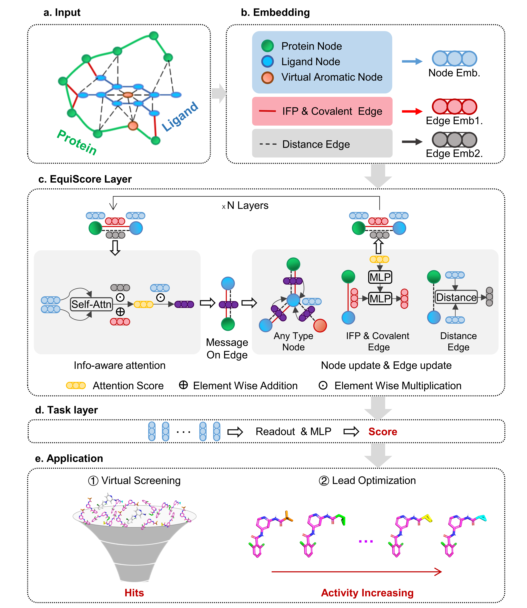

# EquiScore: A generic protein-ligand interaction scoring method integrating physical prior knowledge with data augmentation modeling

### [Paper on BioRXiv](https://www.biorxiv.org/content/10.1101/2023.06.18.545464v2)

Implementation of EquiScore, by Duanhua Cao 😊.

This repository contains all code, instructions and model weights necessary to **screen compounds** by EquiScore, eval EquiScore or to retrain a new model.

If you have any question, feel free to open an issue or reach out to us: [caodh@zju.edu](caodh@zju.edu).

## Dataset

If you want to train one of our models with the PDBscreen data you should to do:

1. download Preprocessed PDBscreen data from [zenodo](https://doi.org/10.5281/zenodo.8049380)
2. uncompress the directory by tar command and place it into `data` such that you have the path `/EquiScore/data/training_data/PDBscreen`
3. see retraining EquiScore part for details.

## Setup Environment

We recommend people to set up the environment using [Anaconda](https://docs.anaconda.com/anaconda/install/index.html).

   Clone the current repo

   git clone git@github.com:CAODH/EquiScore.git

This is an example for how to set up a working conda environment to run the code (but make sure to use the correct pytorch, DGL, cuda versions or cpu only versions):

   `conda create --name EquiScore python=3.8`

   `conda activate EquiScore`

   and then install all pkgs in environment.yml file.

Fortunately! you slao can setup conda environment by command `conda env create -f environment.yml` and done!

## **Using the provided model weights to screen a compound for your target protein**

   We implemented a Screening.py python script, to help **anyone want to screen Hits from a compound library**.

   We provide a toy example under the ./data/sample_data folder for illustration.

### **🚀just some steps need to do**

1. Docking compounds with target protein to get docking pose, EquiScore is robust to pose sources and you can choose any method you are familiar with to generate poses(**Glide,Vina,Surflex,Gold,LeDock**), or you can try a **deep learning method**.
2. Assume that you have obtained the results of the docking in the previous step. Then, get pocket region and compound pose.
   run script:

   `python get_pocket.py --docking_result ./data/sample_data/sample_compounds.sdf --recptor_pdb ./data/sample_data/sample_protein.pdb --single_sdf_save_path ./data/sample_data/tmp_sdfs --pocket_save_dir ./data/sample_data/tmp_pockets`
3. Then, you have all data to predict protein-ligand interaction by EquiScore! Be patient. This is the last step!

   `python Screening.py --ngpu 1 --test --test_path ./data/sample_data/ --test_name tmp_pockets --pred_save_path  ./data/test_results/       EquiScore_pred_for_tmp_pockets.pkl`
4. Util now, you get all prediction result in pred_save_path, and you can read it for select compound by yourself!

## **Using the provided model weights for evaluation and Reproduces the benchmark result**

   Just like screen compounds for a target, benchmark dataset have many targets for screen, so we implemented a script to calculate the results

### **just some steps need to set**

1. We provided Preprocessed pockets on zenodo (download pockets from [zenodo](https://doi.org/10.5281/zenodo.8047224)). IF YOU WANT GET RAW DATASET PLEASE DOWNLOAD RAW DATA FROM REFERENCE PAPERS.
2. you need download the Preprocessed dataset and extract data to ./data/external_test_data.

   (for example, all pockets in DEKOIS2.0 docking by Glide SP should be extract into one dir like ./data/external_test_data/dekois2_pocket)
3. if you want to preprocessed data to get pocket , all pocket file name should contain '_active' for active ligand,'_decoy' for decoys and  all pocket in a dir for one benchmark dataset
4. run script (You can use the nohup command and output redirects as you normally like):

   `python independent_test_dist.py --test --test_path './data/external_test_data' --test_name dekois2_pocket --test_mode milti_pose`

   use **milti_pose** arg if one ligand have multi pose and set pose_num and **idx_style** in args ，see args `--help for more details`

## **Retraining EquiScore 🤖 Model**

### **Retraining EquiScore or fine tune your model is also very simnple!**

1. you need download the traing dataset , and extract pocket data to ./data/training_data/PDBscreen
   (You can also use your own private data, As long as it can fit to EquiScore after processing)
2. use uniport id to deduplicated data and split data in `./data/data_splits/screen_model/data_split_for_training.py`
   in this script, will help deduplicated dataset by uniport id and split train/val data and save data path into a pkl file

   like "train_keys.pkl, val_keys.pkl, test_keys.pkl"
3. run train.py script:

   `python train.py --ngpu 1 --train_keys your_keys_path --val_keys your_keys_path --test_keys_path your_keys_path`

   (**or if you want speed up training, please save data to LMDB database in dataset.py and add --lmdb_cache lmdb_cache_path** )

## Citation

   EquiScore: A generic protein-ligand interaction scoring method integrating physical prior knowledge with data augmentation modeling
   Duanhua Cao, Geng Chen, Jiaxin Jiang, Jie Yu, Runze Zhang, Minan Chen, Wei Zhang, Lifan Chen, Feisheng Zhong, Yingying Zhang, Chenghao Lu, Xutong Li, Xiaomin Luo, Sulin Zhang, Mingyue Zheng
   bioRxiv 2023.06.18.545464; doi: https://doi.org/10.1101/2023.06.18.545464

## License

MIT
